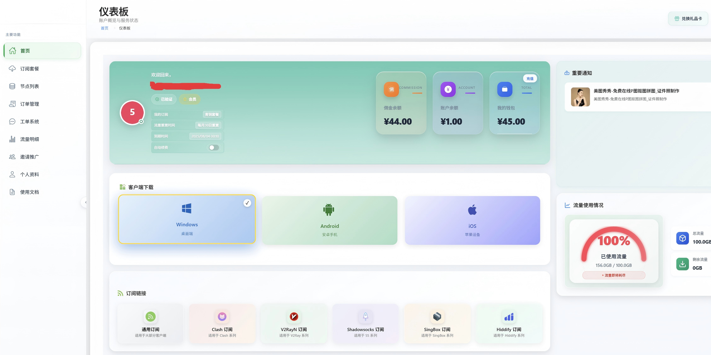
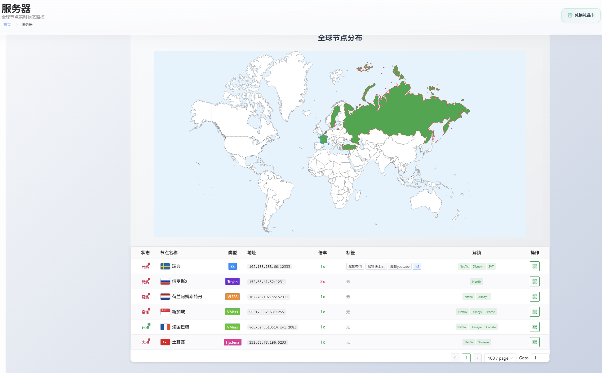
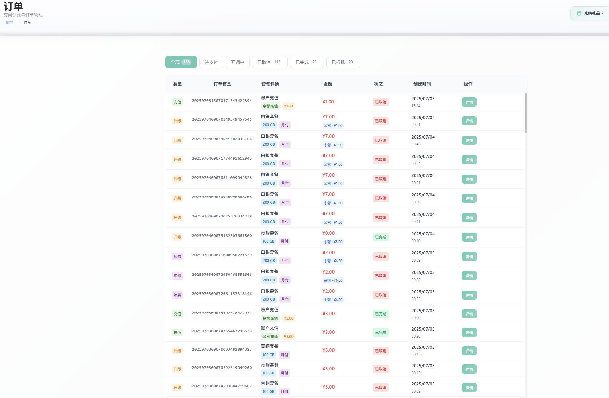
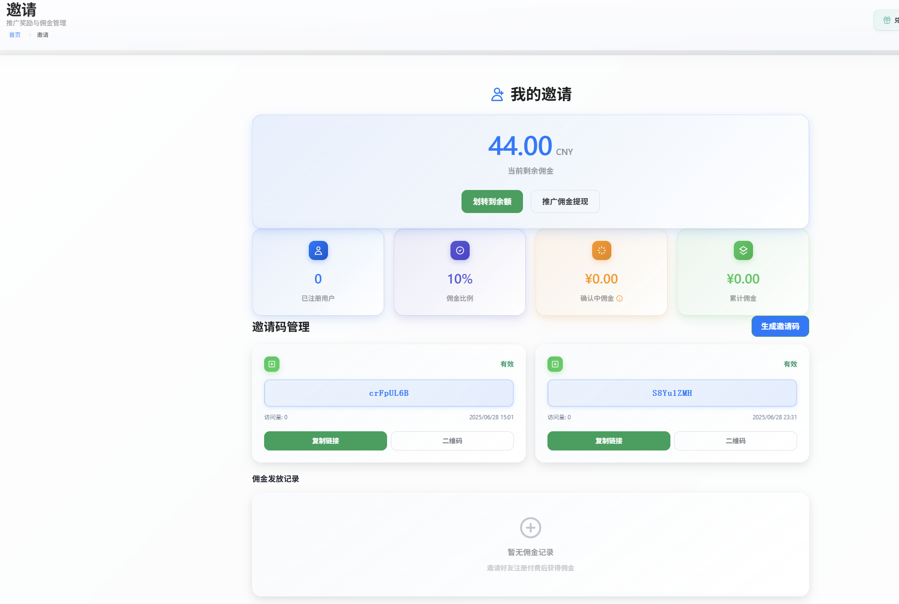

# V2Board Theme Luck

<div align="center">


[](https://t.me/fluentboard666)

**现代化的 V2Board 主题 - Luck**

一个基于 Vue 3 + TypeScript + Naive UI 构建的现代化 V2Board 主题项目，理论支持V2BOARD和Xboard（未测试），提供优雅的用户体验和完整的功能支持。

[在线演示](https://demo.example.com) · [文档](https://docs.example.com) · [问题反馈](https://github.com/your-username/v2board-theme-luck/issues) · [📢 TG频道](https://t.me/fluentboard666)

</div>

## ✨ 特性

### 🎨 现代化设计
- **iOS 风格界面** - 采用 Apple 设计语言，精致的视觉效果
- **响应式布局** - 完美适配桌面端和移动端
- **暗色模式支持** - 自动适应系统主题
- **流畅动画** - 精心设计的过渡效果和交互动画

### 📱 移动端优化
- **原生体验** - 针对移动端深度优化的交互设计
- **大屏适配** - 支持各种大屏手机（iPhone 14 Pro Max 等）
- **触摸友好** - 优化的触摸交互和手势支持
- **PWA 支持** - 可安装为原生应用

### 🛠️ 技术特性
- **Vue 3 Composition API** - 现代化的 Vue 开发体验
- **TypeScript** - 完整的类型安全支持
- **Vite 构建** - 极速的开发和构建体验
- **Pinia 状态管理** - 轻量级的状态管理方案

### 🔧 功能完整
- **用户管理** - 注册、登录、个人资料管理
- **订阅管理** - 套餐购买、订单管理、流量统计
- **节点管理** - 服务器列表、实时状态监控
- **工单系统** - 完整的客服支持系统
- **邀请系统** - 推广奖励和佣金管理
- **支付集成** - 多种支付方式支持

### ⚙️ 配置灵活
- **功能开关** - 可配置的功能模块开关
- **主题定制** - 支持多种主题和自定义配色
- **API 配置** - 灵活的后端 API 配置
- **部署友好** - 支持静态部署和动态配置
- **安全混淆** - 内置配置文件混淆脚本 + 高等级代码混淆，双重保护

## 📸 项目截图

以下是项目的主要功能页面展示，展现了现代化的 iOS 风格设计和完整的功能体验：

<div align="center">

### 🎯 用户仪表板
*现代化的用户中心，展示余额信息和客户端下载*



### 🌐 全球节点分布
*直观的世界地图展示，实时监控全球服务器状态*



### 📋 订单管理
*完整的订单管理系统，支持多种套餐和支付方式*



### 💰 邀请推广
*强大的推广系统，实时统计佣金和邀请数据*



</div>

## ⚙️ 配置说明

### 基础配置

编辑 `public/config.js` 文件：

```javascript
window.V2BOARD_CONFIG = {
  // API 地址配置
  DEFAULT_API_URL: 'https://your-api-domain.com',
  
  // 应用标题
  APP_TITLE: 'Your App Name',
  
  // 功能开关
  FEATURES: {
    INVITE_ENABLED: true,           // 邀请功能
    TICKET_ENABLED: true,           // 工单功能
    GIFTCARD_ENABLED: true,         // 礼品卡功能
    RECHARGE_ENABLED: true,         // 充值功能
    TRAFFIC_DETAILS_ENABLED: true   // 流量明细功能
  }
}
```

### 🔒 配置文件安全混淆

由于 `config.js` 文件可能包含敏感信息（如 API 地址、密钥等），项目提供了配置文件混淆功能来保护这些信息。

#### 使用混淆脚本

项目根目录提供了 `obfuscate.sh` 脚本，可以对配置文件进行 JavaScript 混淆：

```bash
# 运行混淆脚本
./obfuscate.sh
```

#### 混淆流程

1. **准备源文件**：确保项目根目录存在 `original_config.js`（未混淆的原始配置）
2. **运行脚本**：执行 `./obfuscate.sh` 并按提示操作
3. **选择混淆等级**：
   - **低等级**：基础混淆，速度快，适合开发环境
   - **中等级**：平衡混淆，推荐生产环境使用
   - **高等级**：强混淆，最高安全性，适合敏感环境
4. **自动部署**：脚本会自动将混淆后的文件部署到指定目录

#### 混淆特性

- **变量名混淆**：将变量名替换为无意义的字符
- **字符串加密**：对字符串进行编码和加密
- **控制流混淆**：打乱代码执行流程
- **反调试保护**：防止开发者工具调试
- **自我保护**：防止代码被篡改


### 客户端配置

编辑 `public/clients.js` 文件来配置客户端下载信息：

```javascript
window.V2BOARD_CLIENTS = {
  windows: {
    'v2rayN': {
      name: 'V2rayN',
      img: 'https://example.com/icon.png',
      down: 'https://github.com/2dust/v2rayN/releases',
      vs: 'v6.23'
    }
  }
  // ... 更多平台配置
}
```

## 🎨 落地页主题定制

项目支持多种落地页主题定制方式：包括移植的sspanel的主题malio、zhujike、cool、wukong


### 组件主题

使用 Naive UI 的主题定制功能：

```typescript
import { darkTheme } from 'naive-ui'

// 在组件中使用
<n-config-provider :theme="darkTheme">
  <App />
</n-config-provider>
```

## 📱 移动端特性

### 响应式断点

- **Mobile**: < 768px
- **Tablet**: 768px - 1024px  
- **Desktop**: > 1024px

### 移动端组件

项目包含专门的移动端组件：

- `MobileDashboardLayout` - 移动端布局
- `MobileSheet` - 移动端弹出层
- `MobileActionButtons` - 移动端操作按钮


## 🚀 部署指南


#### 1. 配置文件混淆（推荐）

在部署到生产环境前，建议对配置文件进行混淆以提高安全性：

```bash
# 1. 确保 original_config.js 包含正确的生产配置
cp public/config.js original_config.js

# 2. 运行混淆脚本
./obfuscate.sh

# 3. 按提示选择混淆等级（生产环境推荐选择 2 或 3）
# 4. 脚本会自动生成混淆后的 config.js
```


#### 2. 静态部署

##### 宝塔面板部署（推荐）

宝塔面板是最简单的部署方式，适合新手和快速部署：

**步骤 1：创建站点**
1. 登录宝塔面板
2. 点击 `网站` → `添加站点`
3. 填写域名（如：`your-domain.com`）
4. 选择 `PHP版本`：纯静态（或任意版本）
5. 点击 `提交` 创建站点

**步骤 2：上传文件**
1. 在网站列表中找到刚创建的站点
2. 点击 `根目录` 进入文件管理
3. 删除默认的 `index.html` 等文件
4. 将构建后的 `dist` 目录中的所有文件上传到网站根目录
   ```
   网站根目录/
   ├── index.html
   ├── config.js
   ├── clients.js
   ├── assets/
   └── ...
   ```

**步骤 3：配置伪静态**
1. 在网站设置中点击 `伪静态`
2. 选择 `自定义` 并添加以下规则：
   ```nginx
   location / {
       try_files $uri $uri/ /index.html;
   }
   ```
3. 点击 `保存`

**步骤 4：SSL 配置（可选但推荐）**
1. 在网站设置中点击 `SSL`
2. 选择 `Let's Encrypt` 免费证书
3. 点击 `申请` 并等待证书颁发
4. 开启 `强制HTTPS`

**步骤 5：性能优化**
1. 在网站设置中点击 `配置文件`
2. 添加静态资源缓存配置：
   ```nginx
   # 在 server 块中添加
   location ~* \.(js|css|png|jpg|jpeg|gif|ico|svg|woff|woff2|ttf|eot)$ {
       expires 1y;
       add_header Cache-Control "public, immutable";
   }
   ```

##### 传统服务器部署

将 `dist` 目录部署到任何静态文件服务器：

```bash
# 示例：部署到服务器
scp -r dist/* user@server:/var/www/html/
```

### 服务器配置

#### Nginx 配置

```nginx
server {
    listen 80;
    server_name your-domain.com;
    root /path/to/dist;
    index index.html;

    # SPA 路由支持
    location / {
        try_files $uri $uri/ /index.html;
    }

    # 静态资源缓存
    location ~* \.(js|css|png|jpg|jpeg|gif|ico|svg)$ {
        expires 1y;
        add_header Cache-Control "public, immutable";
    }

    # 配置文件安全（可选）
    location ~ ^/(config|clients)\.js$ {
        add_header X-Content-Type-Options nosniff;
        add_header X-Frame-Options DENY;
    }
}
```

#### Apache 配置

```apache
<VirtualHost *:80>
    ServerName your-domain.com
    DocumentRoot /path/to/dist

    # SPA 路由支持
    <Directory "/path/to/dist">
        RewriteEngine On
        RewriteBase /
        RewriteRule ^index\.html$ - [L]
        RewriteCond %{REQUEST_FILENAME} !-f
        RewriteCond %{REQUEST_FILENAME} !-d
        RewriteRule . /index.html [L]
    </Directory>
</VirtualHost>
```


### 代码规范

- 使用 TypeScript 进行类型检查
- 遵循 Vue 3 Composition API 最佳实践
- 保持代码简洁和可读性
- 添加必要的注释和文档

## 💬 社区与支持


### 🤝 获取帮助
- **问题反馈**: 在 [GitHub Issues](https://github.com/q42602736/v2board-theme-luck/issues) 提交 Bug 报告或功能请求
- **技术讨论**: 加入我们的 Telegram 频道参与技术讨论
- **文档支持**: 查看项目文档获取详细的使用指南


## 🙏 致谢

- [Vue.js](https://vuejs.org/) - 渐进式 JavaScript 框架
- [Naive UI](https://www.naiveui.com/) - Vue 3 组件库
- [Vite](https://vitejs.dev/) - 下一代前端构建工具
- [TypeScript](https://www.typescriptlang.org/) - JavaScript 的超集

---

<div align="center">

**如果这个项目对你有帮助，请给它一个 ⭐️**

Made with ❤️ by [q42602736](https://github.com/q42602736)

</div>
